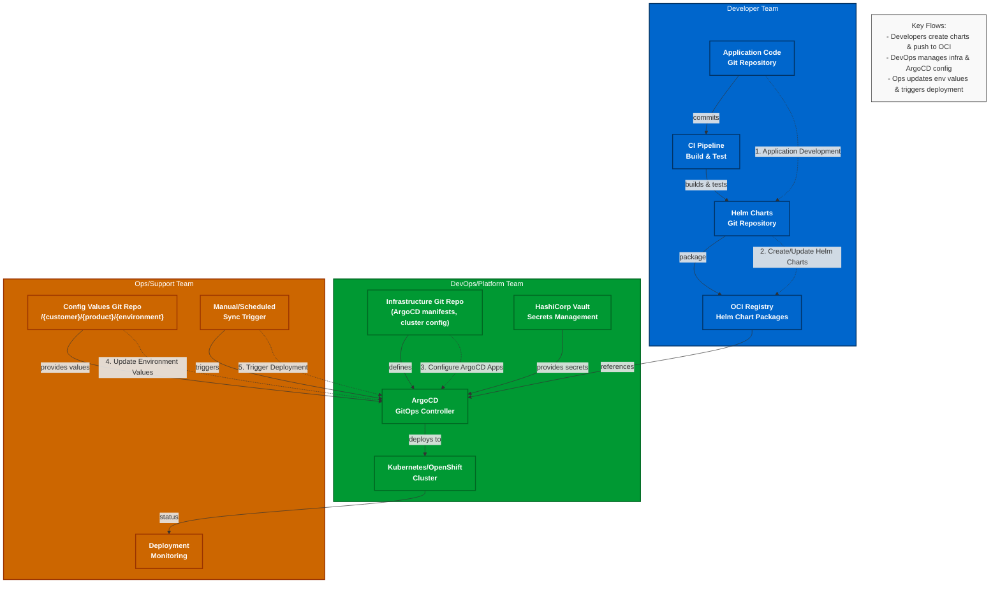
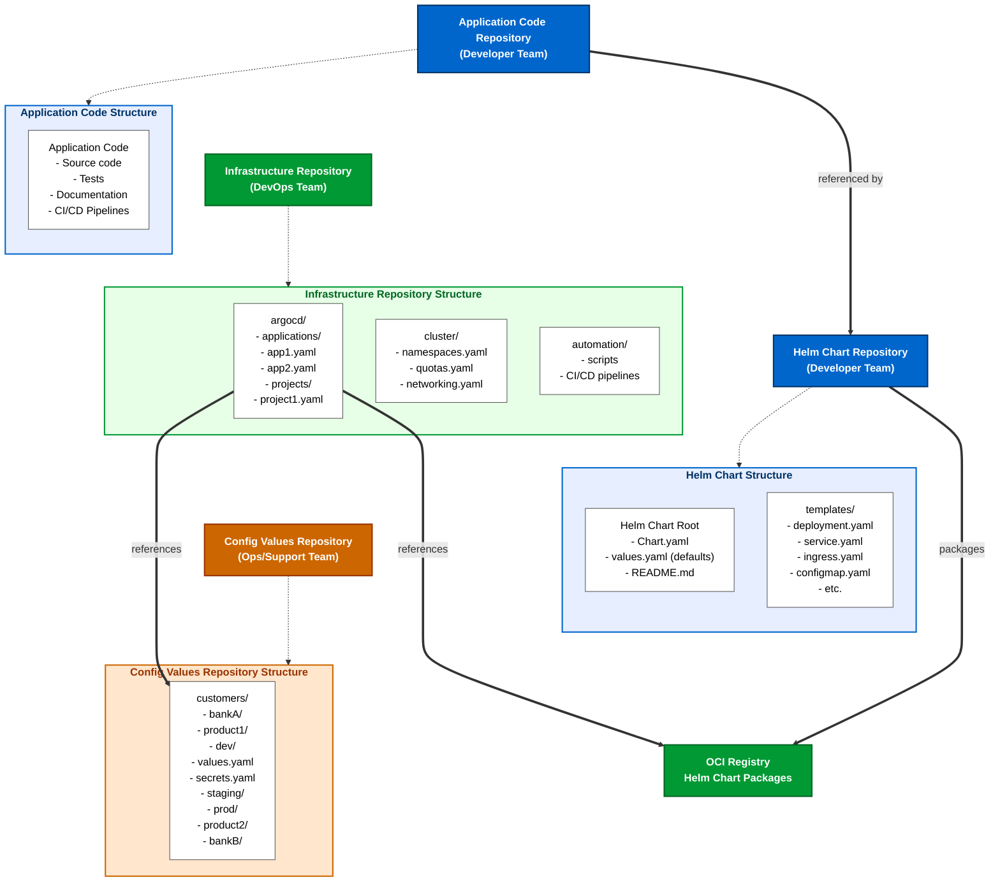
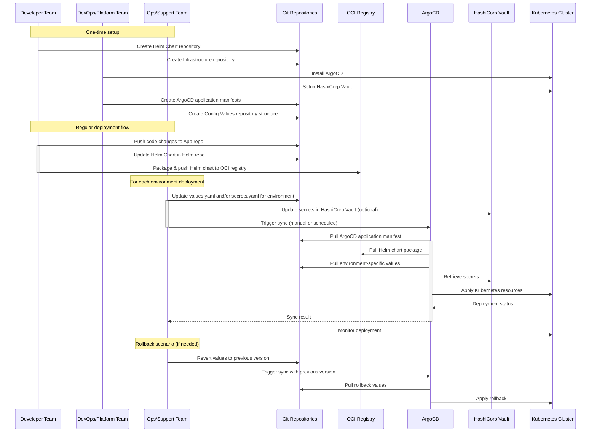

# Team Responsibilities with Helm Charts

## Developer Team
- Create and maintain application code
- Develop Helm charts for the application
- Package Helm charts as OCI artifacts
- Push Helm chart packages to OCI registry
- Define default configuration in values.yaml
- Create templates for required Kubernetes resources
- Define Chart.yaml with dependencies and metadata
- Implement proper versioning for Helm charts
- Document chart usage and configuration options

## DevOps/Platform Team
- Set up and maintain ArgoCD infrastructure
- Configure GitOps workflow and repositories
- Create ArgoCD application manifests
- Configure sync policies and schedules
- Set up HashiCorp Vault integration
- Configure Kong API gateway ingress
- Implement F5 AS3 for load balancing
- Set up CI/CD pipelines to validate charts
- Implement OpenShift/Kubernetes cluster policies
- Configure cluster and namespace resource quotas

## Ops/Support Team
- Maintain the git-values repository structure
- Update environment-specific values in git-values repo
- Manage secrets in HashiCorp Vault or inject into git-values
- Approve and trigger deployments to production
- Schedule production deployments
- Monitor deployments and application health
- Perform rollbacks when necessary
- Maintain emergency access procedures
- Audit deployment logs and activities
- Manage certificate renewals

## Phase 1: Initial Setup

### Developer Team
1. Develop application code in their repository
2. Create Helm chart structure (templates, values.yaml, Chart.yaml)
3. Package Helm chart as OCI artifact
4. Push Helm chart to OCI registry with proper versioning
5. Document chart configuration options

### DevOps/Platform Team
1. Set up ArgoCD infrastructure on the Kubernetes/OpenShift cluster
2. Create git-values repository structure for environment-specific values
3. Configure HashiCorp Vault integration for secrets management
4. Create ArgoCD application manifests that reference:
   - OCI Helm chart repository
   - git-values repository
5. Configure Kong API gateway for application routing
6. Set up F5 AS3 for load balancing

## Phase 2: Deployment Process

### Continuous Process
1. **Developers** update application code and Helm charts
2. CI pipeline builds, tests, packages, and pushes Helm chart to OCI registry
3. **DevOps** team updates ArgoCD application manifests when needed

### Per Deployment
1. **Ops/Support** team updates environment-specific values.yaml in git-values repo
2. **Ops/Support** manages secrets in HashiCorp Vault or updates encrypted secrets
3. ArgoCD detects changes to values or OCI chart versions
4. **Ops/Support** manually triggers or schedules the deployment sync
5. ArgoCD pulls latest Helm chart and values, applies to Kubernetes
6. **Ops/Support** monitors deployment health and metrics

## GitOps Flow Details

1. **Source Control**:
   - Application code and Helm charts in one repository (managed by Developers)
   - Environment-specific values in git-values repository (managed by Ops)
   - ArgoCD application manifests in GitOps repository (managed by DevOps)

2. **OCI Registry**:
   - Versioned Helm charts stored as OCI artifacts
   - Immutable artifacts ensure deployment consistency

3. **ArgoCD Configuration**:
   - Application manifests define the relationship between:
     - Helm chart (from OCI registry)
     - Values (from git-values repository)
     - Target Kubernetes namespace

4. **Secret Management**:
   - HashiCorp Vault stores sensitive information
   - ArgoCD can be configured to pull secrets from Vault at sync time
   - Alternatively, sealed secrets or other encryption can be used in git-values repo

5. **Deployment Triggering**:
   - Manual triggering by Ops for production environments
   - Scheduled syncs for maintenance windows
   - Automatic syncs for lower environments (dev, QA)

## Key Benefits for Banking SoD Requirements

1. **Clear Separation of Duties**:
   - Developers cannot deploy directly to any environment
   - DevOps team manages the platform but not application values
   - Ops team controls when deployments happen but cannot modify application code

2. **Audit Trail**:
   - All changes are tracked in Git repositories
   - Deployment history is maintained in ArgoCD
   - Approvals can be enforced through pull requests

3. **Security**:
   - Secrets are managed securely through HashiCorp Vault
   - No direct cluster access required for routine deployments
   - RBAC controls who can access what resources

4. **Consistency**:
   - Same deployment mechanism across all environments
   - Reduced risk of configuration drift
   - Compliance with banking regulations through clear responsibilities

-------------

## GitOps Workflow with Clear Repository Separation

### Repository Structure

1. **Developer Team Repositories:**
   - **Application Code Repository:** Contains the source code, tests, documentation
   - **Helm Chart Repository:** Contains all Helm charts separate from application code
     - This separation allows chart versioning independent from app versioning
     - Chart updates can happen without code changes (configuration improvements)
     - Multiple applications can share chart patterns

2. **DevOps/Platform Team Repository:**
   - **Infrastructure Repository:** Contains ArgoCD application manifests and cluster configurations
     - ArgoCD application definitions reference both the OCI chart and config values repos
     - Cluster-wide resources (namespaces, network policies, etc.)
     - Automation scripts and pipelines for infrastructure

3. **Ops/Support Team Repository:**
   - **Config Values Repository:** Organized by customer/product/environment
     - Clear hierarchy: `/{customer}/{product}/{environment}/values.yaml`
     - Environment-specific configurations
     - Encrypted secrets or references to external secret stores

### Workflow Benefits

1. **Clear Ownership Boundaries:**
   - Developers own application code and Helm templates
   - DevOps owns infrastructure configuration and deployment platform
   - Ops owns environment-specific values and deployment timing

2. **Audit Trail:**
   - Each team's changes are tracked separately
   - Pull request reviews can enforce team-specific approvals
   - Clear history of who changed what and when

3. **Improved Security:**
   - Limited access to production values (Ops only)
   - Developers can't directly modify environment configurations
   - Infrastructure changes require DevOps team approval

4. **Simplified Troubleshooting:**
   - Issues can be traced to specific repositories/teams
   - Rollbacks can be performed at different levels (app code, chart, values)

### Deployment Process

As shown in the sequence diagram:

1. **Development Phase:**
   - Developers update application code
   - Developers update Helm charts and push to separate repository
   - CI/CD builds and packages Helm charts as OCI artifacts

2. **Configuration Phase:**
   - DevOps creates/updates ArgoCD application manifests as needed
   - Ops updates environment-specific values for target deployment
   - Ops manages secrets in HashiCorp Vault or as encrypted secrets

3. **Deployment Phase:**
   - Ops triggers deployment manually or via schedule
   - ArgoCD pulls latest charts from OCI registry
   - ArgoCD pulls latest values from config values repository
   - ArgoCD pulls secrets from Vault or decrypts from git
   - ArgoCD applies resources to Kubernetes cluster

4. **Monitoring Phase:**
   - Ops monitors deployment success and application health
   - Rollbacks can be performed by reverting values or changing chart version

### Banking-Specific Considerations

For a banking environment, this separation provides:

1. **Regulatory Compliance:**
   - Clear separation of duties meets financial regulatory requirements
   - Audit trails for all changes across environments
   - Limited access to production configurations and secrets

2. **Risk Mitigation:**
   - Changes can be tested in lower environments with identical processes
   - Production deployments require explicit Ops team actions
   - Fast rollback capabilities if issues arise

3. **Security:**
   - Secrets are managed securely through Vault or encryption
   - Limited number of people with direct cluster access
   - Multiple levels of review before changes reach production

---------

I'll update the other two Mermaid diagrams with better contrast to improve readability:

Now let's update the repository structure diagram with better contrast:

Let's also update the sequence diagram to make it more readable:

The diagrams have been updated with improved contrast for better readability. Here's a summary of the changes made:

1. **GitOps Workflow Diagram**:

2. **Repository Structure Diagram**:

3. **Deployment Sequence Diagram**:

