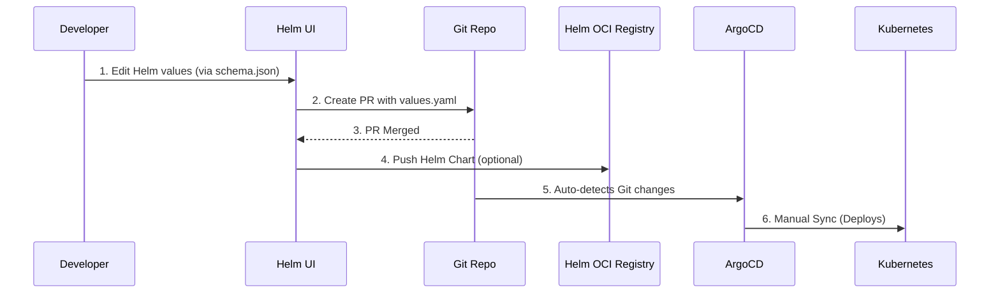
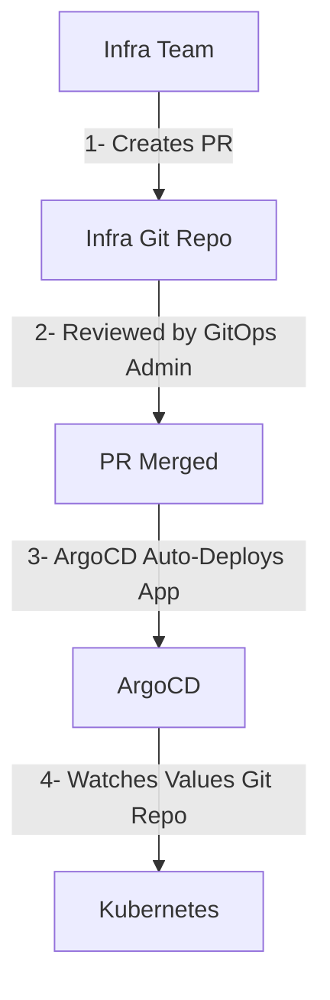
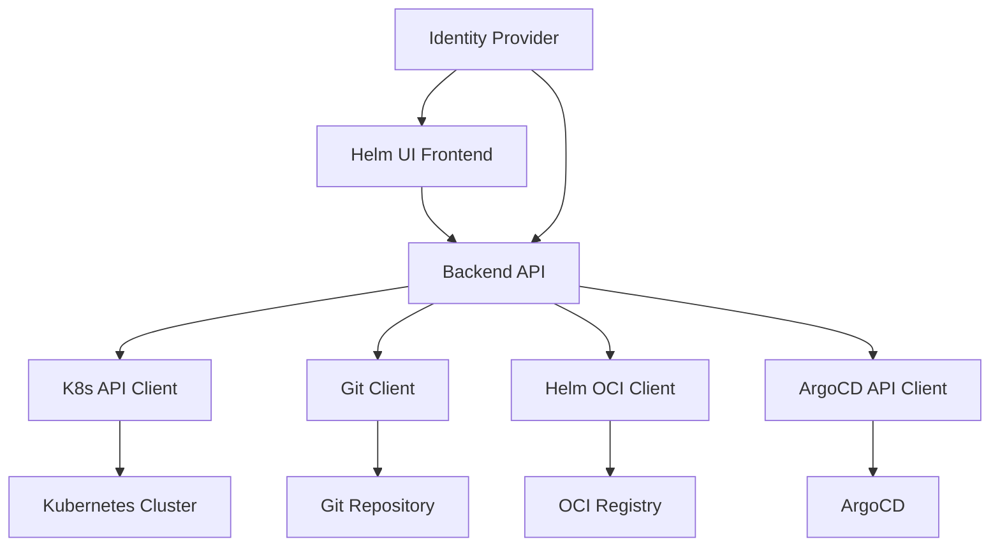

# ConfigPilot Electron

A minimal Electron + Vite + React-based UI for editing Helm `values.yaml` files using JSON Schema.

---

## 🛠 Development Workflow

### 🔁 Option A: Frontend Only (Fast Dev)
```bash
cd app
npm run frontend
```
Open `http://localhost:5173` in your browser.

---

### 🖥️ Option B: Full App (Electron + UI)
```bash
npm run dev
```
This runs:
- `tsc` to compile Electron code
- Vite dev server
- Electron window loading Vite

Use `Ctrl+Shift+I` inside Electron to open DevTools.

---

## 📂 Folder Structure
```
helm-editor-electron/
├── app/
│   ├── index.html         # Vite entrypoint
│   ├── vite.config.ts     # Local Vite config
│   ├── src/               # React source code
│   │   ├── App.tsx
│   │   └── main.tsx
│   └── mock/              # Example schema and values
├── electron/
│   ├── main.ts            # Electron main process
│   └── preload.ts         # IPC bridge
├── dist/                  # Build output
└── package.json           # Scripts + deps
```

---

## 📦 Scripts
```json
"scripts": {
  "dev": "concurrently \"npm:electron-start\" \"npm:frontend\"",
  "frontend": "vite",
  "electron-start": "npm run electron-build && electron dist/electron/main.js",
  "electron-build": "tsc"
}
```

---

## 🔄 Clean Build
```bash
rm -rf node_modules dist app/dist
npm install
```

---

## Typical Flow







## ✅ Next Steps
- ✅ Restore JSON Schema form (done)
- 🔜 Add Save button using Electron IPC
- 🔜 Hook up to Git (e.g., create PR from change)

---

### Security Model

For a unified security approach across these systems, I recommend:

1. **OAuth2/OIDC as the foundation**:

1. Use OpenID Connect for authentication across all systems
2. Integrate with identity providers like Azure AD, Okta, or Auth0


2. **Service Account Pattern**:

1. Create dedicated service accounts for your application
2. Use Kubernetes service accounts with limited RBAC permissions
3. Use personal access tokens or deploy keys for Git operations


3. **Credential Management**:

1. Store credentials in Kubernetes secrets
2. Use a secrets management solution like HashiCorp Vault
3. Implement credential rotation policies


### Integration Architecture

The architecture follows this pattern:


### Implementation Components

I've created several components to implement this integration:

1. **K8sContextSelector**: Allows users to select their Kubernetes context
2. **NamespaceSelector**: For selecting the target namespace
3. **GitRepositorySelector**: Connects to Git repositories with authentication options
4. **HelmRepositorySelector**: Configures Helm repositories (OCI or HTTP)
5. **ArgoApplicationSelector**: Integrates with ArgoCD applications
6. **IntegrationSetup**: Combines all these components into a unified setup flow


### Backend Requirements

For this to work in production, you'll need to implement a backend service that:

1. Provides a secure API for the frontend to communicate with
2. Handles authentication and authorization
3. Manages credentials securely (never exposing them to the frontend)
4. Implements the actual integration with Kubernetes, Git, Helm, and ArgoCD